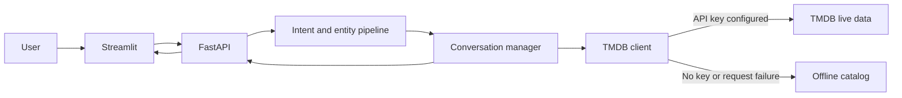

# CineBot

[](https://github.com/PranaPragada7/CineBot-NLP-Project/actions/workflows/ci.yml)


CineBot is a movie-discovery assistant with a conversational Streamlit
interface and a FastAPI backend. It detects movie-related intent, extracts
titles, keeps session context, and retrieves details and recommendations from
TMDB when an API key is available.

The application remains fully usable without credentials through a small,
deterministic offline catalog. That makes local setup, automated tests, and
classroom demonstrations reliable even when an external API is unavailable.


## Features

- Movie information and director lookup
- Similar-title recommendations
- Trending and upcoming-movie queries
- Intent detection, title extraction, and lightweight sentiment signals
- Context-aware follow-up questions within a session
- Feedback and conversation-history API endpoints
- Live TMDB data with an automatic offline fallback
- Responsive Streamlit interface and documented REST API

## Architecture



The API does not download machine-learning models during startup. Its local
pipeline is fast and deterministic, while TMDB provides richer live data when
configured.

## Quick start

Requirements:

- Python 3.11 or newer
- Optional: a [TMDB API key](https://developer.themoviedb.org/docs/getting-started)

Create a virtual environment and install the project:

```powershell
python -m venv .venv
.\.venv\Scripts\Activate.ps1
python -m pip install -r requirements.txt
```

For macOS or Linux, activate the environment with:

```bash
source .venv/bin/activate
```

Optionally copy the environment template and add a TMDB key:

```powershell
Copy-Item .env.example .env
```

Start the API:

```powershell
uvicorn src.app:app --reload
```

In a second terminal, start the interface:

```powershell
streamlit run src/frontend/streamlit_app.py
```

Open `http://127.0.0.1:8501`. Without a TMDB key, the sidebar reports that
the built-in offline catalog is active.

## API

| Method | Endpoint | Purpose |
|---|---|---|
| `GET` | `/health` | Service status and active data source |
| `POST` | `/chat` | Process a movie question |
| `POST` | `/feedback` | Save a rating for an assistant message |
| `GET` | `/history/{session_id}` | Return the session conversation |
| `DELETE` | `/history/{session_id}` | Clear the session conversation |

Interactive API documentation is available at `http://127.0.0.1:8000/docs`.

## Docker

Run the API and interface together:

```powershell
docker compose up --build
```

The compose file passes `TMDB_API_KEY` at runtime. Credentials are never copied
into the container image.

## Deployment notes

- The in-memory conversation store is intended for a single-process demo. A
  production deployment should use a shared persistent store.
- The built-in catalog is deliberately small and exists for reliable local
  demonstrations, not as a replacement for TMDB's live catalog.
- Live results depend on TMDB availability, rate limits, and API-key access.
- Feedback is retained only for the life of the API process.

## Quality checks

```powershell
python -m pip install -r requirements-dev.txt
python -m black --check .
python -m ruff check .
python -m compileall -q src
python -m pytest -q
```

The tests run entirely against the offline catalog and do not make live TMDB
requests. Coverage must remain at or above 80% across the application package.

## Project structure

| Path | Purpose |
|---|---|
| `src/app.py` | FastAPI application and request models |
| `src/conversation.py` | Session context and request orchestration |
| `src/nlp/pipeline.py` | Intent, title, and sentiment extraction |
| `src/services/tmdb.py` | Live TMDB access with offline fallback |
| `src/catalog.py` | Deterministic demo catalog |
| `src/frontend/streamlit_app.py` | Streamlit conversation interface |
| `tests/` | API, NLP, conversation, data-client, and UI tests |
| `.github/workflows/ci.yml` | Automated formatting, lint, compile, and test checks |

## Configuration

| Variable | Required | Default |
|---|---:|---|
| `TMDB_API_KEY` | No | Offline catalog |
| `CINEBOT_API_URL` | No | `http://127.0.0.1:8000` |

This product uses the TMDB API but is not endorsed or certified by TMDB.

See [`CHANGELOG.md`](CHANGELOG.md) for release history and
[`CONTRIBUTING.md`](CONTRIBUTING.md) for contribution guidelines.
