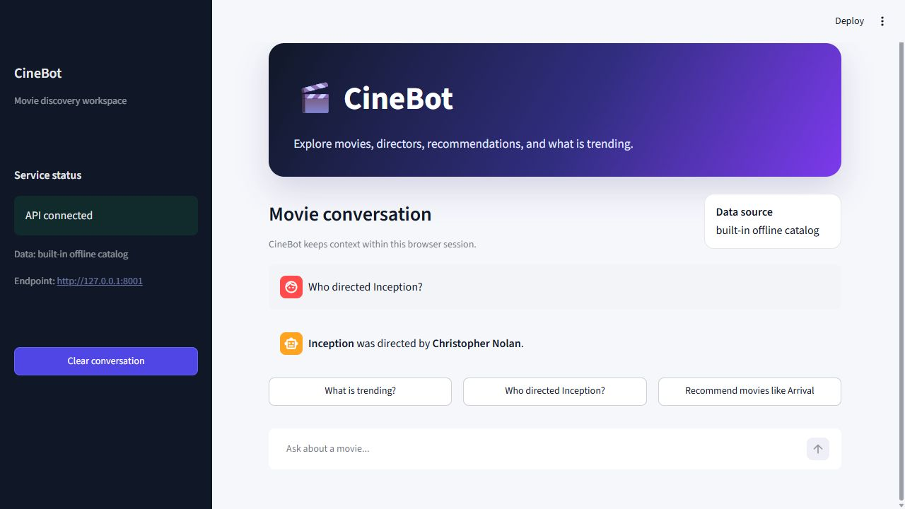
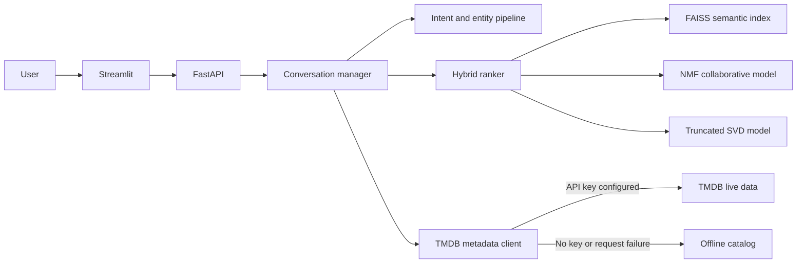

# CineBot

[](https://github.com/PranaPragada7/CineBot-NLP-Project/actions/workflows/ci.yml)


CineBot is an explainable hybrid movie recommender with a conversational
Streamlit interface and FastAPI backend. It combines FAISS content retrieval,
non-negative matrix factorization (NMF), truncated SVD, and a small quality
prior instead of treating recommendations as a metadata lookup.

The complete recommendation path runs without credentials. TMDB enriches movie
metadata when configured, while a versioned 24-title catalog and 144 seeded demo
interactions keep local development, evaluation, CI, and Docker reproducible.



## Features

- Movie information and director lookup
- Similar-title, natural-language, and personalized recommendations
- FAISS inner-product search over TF-IDF + latent-semantic embeddings
- Independent NMF and truncated-SVD collaborative models
- Per-result component scores explaining the hybrid rank
- Session taste profiles updated through explicit 1–5 movie ratings
- Trending and upcoming-movie queries
- Intent detection, title extraction, and lightweight sentiment signals
- Context-aware follow-up questions within a session
- Feedback and conversation-history API endpoints
- Live TMDB data with an automatic offline fallback
- Responsive Streamlit interface and documented REST API

## Architecture



### Ranking pipeline

1. Movie title, director, genres, and overview are vectorized with TF-IDF and
   projected into a 16-dimensional latent-semantic space.
2. Normalized vectors are loaded into `faiss.IndexFlatIP` for exact nearest-
   neighbor search. Restricted hosts that cannot load native FAISS libraries use
   an explicitly reported NumPy exact-search fallback; Docker and Linux CI use
   FAISS.
3. NMF learns non-negative user/item factors from the interaction matrix.
4. Truncated SVD learns a separate centered latent-factor representation.
5. The ranker blends semantic, NMF, SVD, and quality scores. It removes the seed
   title and titles the current user already rated, then returns every component
   score with the result.

These models use only checked-in fixtures at startup and do not download weights
or datasets. `POST /ratings` retrains the small collaborative matrix under a lock
so a session can immediately demonstrate personalization.

## Quick start

Requirements:

- Python 3.11 or newer
- Optional: a [TMDB API key](https://developer.themoviedb.org/docs/getting-started)

Create a virtual environment and install the project:

```powershell
python -m venv .venv
.\.venv\Scripts\Activate.ps1
python -m pip install -r requirements.txt
```

For macOS or Linux, activate the environment with:

```bash
source .venv/bin/activate
```

Optionally copy the environment template and add a TMDB key:

```powershell
Copy-Item .env.example .env
```

Start the API:

```powershell
uvicorn src.app:app --reload
```

In a second terminal, start the interface:

```powershell
streamlit run src/frontend/streamlit_app.py
```

Open `http://127.0.0.1:8501`. Without a TMDB key, the sidebar reports that
the built-in offline catalog is active.

## API

| Method | Endpoint | Purpose |
|---|---|---|
| `GET` | `/health` | Service status and active data source |
| `POST` | `/chat` | Process a movie question |
| `POST` | `/recommendations` | Run the explainable hybrid ranker |
| `POST` | `/ratings` | Add/update a 1–5 user/movie rating |
| `POST` | `/feedback` | Save a rating for an assistant message |
| `GET` | `/history/{session_id}` | Return the session conversation |
| `DELETE` | `/history/{session_id}` | Clear the session conversation |

Interactive API documentation is available at `http://127.0.0.1:8000/docs`.

Example hybrid request:

```powershell
$body = @{
  seed_title = "Arrival"
  query = "thoughtful science fiction about identity"
  user_id = "demo-user"
  limit = 5
} | ConvertTo-Json

Invoke-RestMethod -Method Post -Uri http://127.0.0.1:8000/recommendations `
  -ContentType application/json -Body $body
```

Each result includes `match_score`, the underlying `semantic`, `nmf`, `svd`, and
`quality` signals, and a short reason identifying its strongest signal.

## Docker

Run the API and interface together:

```powershell
docker compose up --build
```

The compose file passes `TMDB_API_KEY` at runtime. Credentials are never copied
into the container image.

## Deployment notes

- The in-memory conversation store is intended for a single-process demo. A
  production deployment should use a shared persistent store.
- The built-in catalog and ratings are deliberately small, synthetic fixtures.
  They prove the end-to-end model architecture; they are not evidence of quality
  on real user traffic and are not a replacement for a production dataset.
- Live results depend on TMDB availability, rate limits, and API-key access.
- Ratings and feedback are retained only for the life of the API process.
- Re-fitting synchronously is appropriate for this tiny demonstrator. A larger
  deployment should train asynchronously, version artifacts, and load them into
  stateless API replicas.

## Quality checks

```powershell
python -m pip install -r requirements-dev.txt
python -m black --check .
python -m ruff check .
python -m compileall -q src
python -m pytest -q
python -m scripts.evaluate_recommender
```

The tests run entirely against the offline catalog and do not make live TMDB
requests. Coverage must remain at or above 80% across the application package.

### Offline recommender evaluation

The evaluation hides one positive interaction per seeded demo user, trains on
the remaining interactions, and checks the personalized top five:

| Metric | Result |
|---|---:|
| Users | 12 |
| Catalog | 24 movies |
| Hit Rate@5 | 0.5833 |
| Mean Reciprocal Rank | 0.3083 |

This is a regression test on synthetic fixtures, not a claim about production
recommendation accuracy. Its purpose is to catch ranking regressions and make
the evaluation method inspectable.

## Project structure

| Path | Purpose |
|---|---|
| `src/app.py` | FastAPI application and request models |
| `src/conversation.py` | Session context and request orchestration |
| `src/nlp/pipeline.py` | Intent, title, and sentiment extraction |
| `src/recommendation.py` | FAISS retrieval and hybrid NMF/SVD ranking |
| `src/services/tmdb.py` | Live TMDB access with offline fallback |
| `src/catalog.py` | Deterministic catalog and seeded demo interactions |
| `src/frontend/streamlit_app.py` | Streamlit conversation interface |
| `scripts/evaluate_recommender.py` | Leave-one-out ranking evaluation |
| `tests/` | API, NLP, conversation, data-client, and UI tests |
| `.github/workflows/ci.yml` | Automated formatting, lint, compile, and test checks |

## Configuration

| Variable | Required | Default |
|---|---:|---|
| `TMDB_API_KEY` | No | Offline catalog |
| `CINEBOT_API_URL` | No | `http://127.0.0.1:8000` |

This product uses the TMDB API but is not endorsed or certified by TMDB.

See [`CHANGELOG.md`](CHANGELOG.md) for release history and
[`CONTRIBUTING.md`](CONTRIBUTING.md) for contribution guidelines.
